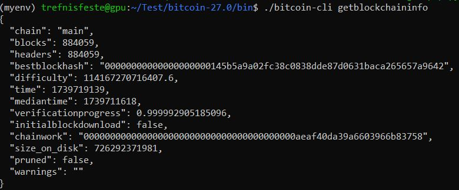
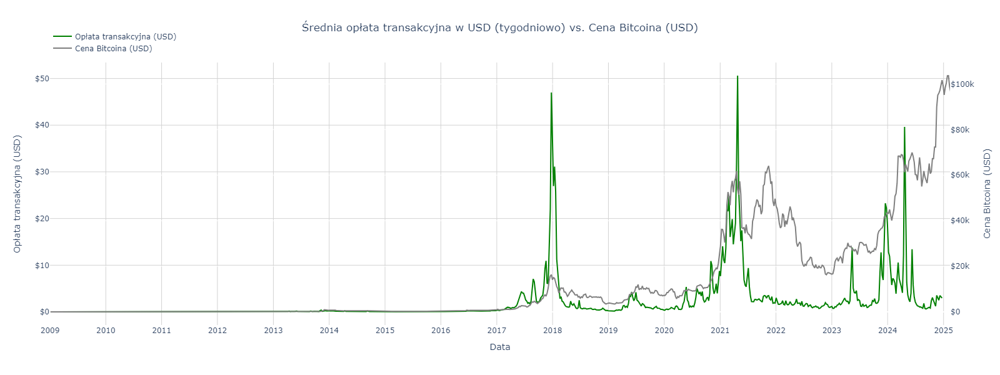
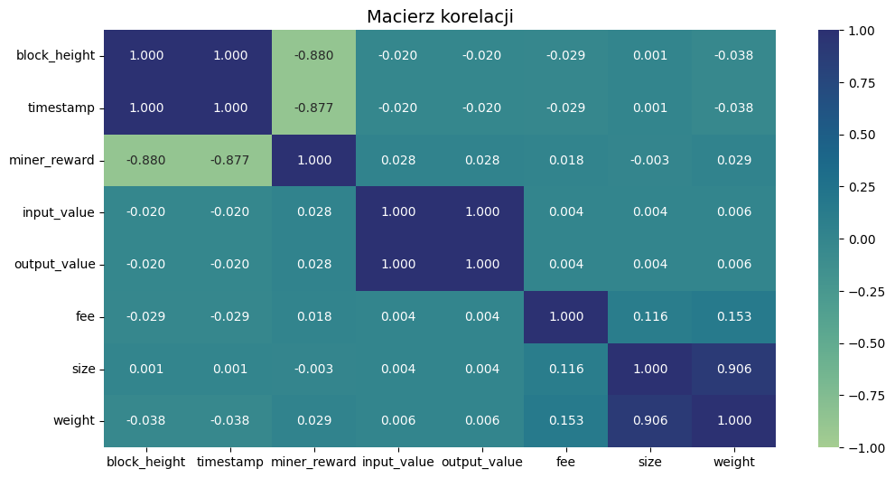
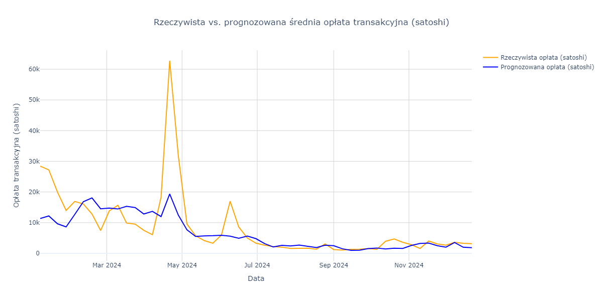
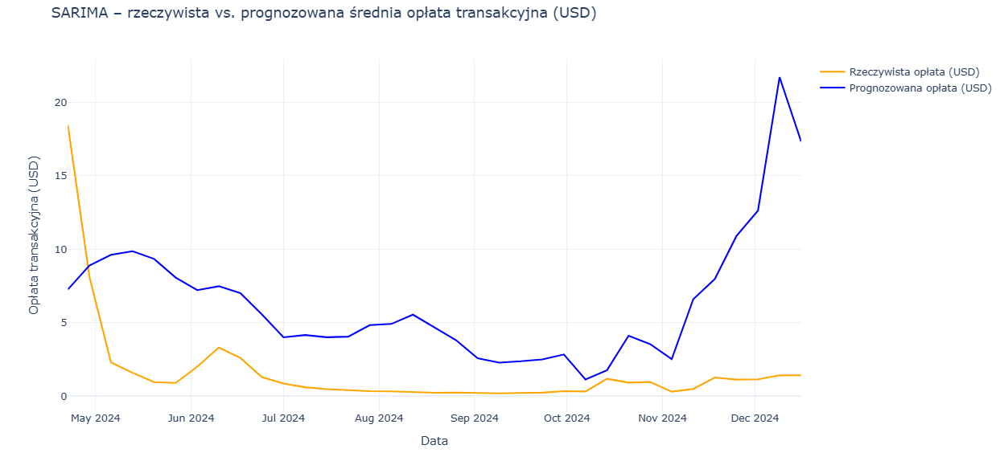

# Analiza i prognozowanie opłat transakcyjnych sieci Bitcoina

## Opis projektu

Celem projektu było lepsze zrozumienie, jak kształtują się opłaty transakcyjne w sieci Bitcoin oraz ocena możliwości ich skutecznego prognozowania na podstawie danych samodzielnie pozyskanych z blockchaina.

Porównano dwa podejścia prognostyczne:

- **Wielowymiarowe** – oparte na wielu cechach opisujących dany blok i transakcje,
- **Jednowymiarowe** – możliwe do zastosowania w praktycznych przypadkach, gdy dostępne są tylko podstawowe informacje (np. numer bloku, czas).

Pozwoliło to na ocenę skuteczności modeli w różnych warunkach oraz lepsze zrozumienie mechanizmów działania sieci Bitcoin.

## Automatyczne pozyskiwanie i przetwarzanie danych z blockchaina Bitcoina

W celu pozyskania danych nawiązano połączenie VPN z serwerem koła naukowego, gdzie zainstalowano i skonfigurowano pełny węzeł Bitcoin Core.

<p align="center">
  
</p>

Dane o blokach były automatycznie pobierane w ustalonych zakresach za pomocą skryptu [`Pobierz_Bloki_V4.py`](data_download/Pobierz_Bloki_V4.py), napisanego w Pythonie. Początkowo dane zapisywano w formacie CSV, jednak ze względu na duży rozmiar plików, zdecydowano się na format **Parquet**, znacznie wydajniejszy przy pracy z dużymi zbiorami.

Następnie użyto skryptu [`Pobierz_Probke.py`](data_download/Pobierz_Probke.py), który losowo wybiera 1% rekordów z każdego pliku. Dzięki temu wygenerowano próbkę, która:

- zachowuje chronologię oryginalnych danych,
- a jednocześnie jest wystarczająco mała, by umożliwić efektywną analizę i modelowanie.

## Eksploracyjna analiza danych (EDA)

W ramach eksploracyjnej analizy danych (EDA) przeprowadzono szereg wizualizacji i analiz statystycznych, mających na celu lepsze zrozumienie zależności pomiędzy cechami zbioru danych. Przeanalizowano m.in. zmienność liczby transakcji w bloku, wartość przesyłanych środków, rozmiar bloków, nagrody dla górników oraz wysokość opłat transakcyjnych.

Dodatkowo, korzystając z platformy [https://www.blockchain.com](https://www.blockchain.com/explorer/charts/market-price), w dniu 18 lutego 2025 roku pobrano plik JSON zawierający historyczne dane cenowe Bitcoina. Dane te stanowią cenne uzupełnienie zbioru danych, umożliwiając porównanie zmian cenowych z innymi parametrami blockchaina. Uwzględnienie danych cenowych przyczyniło się do lepszego zrozumienia dynamiki ekosystemu Bitcoina.

### Rysunek 3.6: Średnia opłata transakcyjna w USD (tygodniowo) vs. Cena Bitcoina

<p align="center">
  
</p>

Wykres ukazuje zależność pomiędzy średnią opłatą transakcyjną wyrażoną w USD a ceną Bitcoina. Zauważalna jest ogólna zgodność trendów – w okresach wzrostu ceny Bitcoina obserwuje się również wzrost opłat, co może świadczyć o zwiększonym obciążeniu sieci i rosnącym zainteresowaniu użytkowników.

### Rysunek 3.7: Macierz korelacji (Pearsona)

<p align="center">
  
</p>

Analiza macierzy korelacji pozwala wskazać kilka istotnych zależności:

- **Silna dodatnia korelacja** pomiędzy `block_height` a `timestamp` (~1) – wynika z rosnącej struktury blockchaina.
- **Silna dodatnia korelacja** między `input_value` a `output_value` (~1) – różnica między nimi to opłata transakcyjna, zazwyczaj niewielka.
- **Silna korelacja** między `size` a `weight` (~0.91) – obie zmienne opisują rozmiar danych w bloku.
- **Silna ujemna korelacja** `block_height` a `miner_reward` (~-0.88) – odzwierciedla wpływ halvingu na zmniejszającą się nagrodę blokową.
- Pozostałe zmienne wykazują słabe korelacje z innymi cechami, w tym opłatami.

## Przetwarzanie danych

W celu przygotowania danych do trenowania modeli predykcyjnych wykonano następujące kroki:

- **Imputacja braków danych** – nie stwierdzono brakujących wartości.
- **Inżynieria cech** – na podstawie daty utworzono nowe zmienne: rok, miesiąc, dzień, dzień tygodnia.
- **Podział danych**:
  - `train`: 2009-01-09 — 2022-01-01  
  - `validation`: 2022-01-01 — 2024-01-01  
  - `test`: 2024-01-01 — 2024-12-16
- **Selekcja zmiennych** – wykorzystano tylko kolumny numeryczne oraz `DayOfWeek` jako cechę kategoryczną.
- **Skalowanie danych** – zastosowano `MinMaxScaler` do przeskalowania danych numerycznych.
- **Kodowanie kategorii** – użyto one-hot encoding dla zmiennej `DayOfWeek`.

## Trenowanie i ocena modeli wielowymiarowych

Na podstawie danych wyodrębniono szereg cech opisujących bloki i transakcje w sieci Bitcoin, które posłużyły jako wejście do klasycznych modeli regresyjnych.

Przetestowano różne algorytmy, m.in.:
- Regresję liniową i jej warianty (Ridge, ElasticNet),
- Drzewa decyzyjne,
- Random Forest,
- Gradient Boosting,
- XGBoost.

Modele oparte na drzewach (szczególnie XGBoost) osiągały lepsze wyniki niż klasyczne regresje, co uzasadniło ich dalsze wykorzystanie.

## Dostrajanie hiperparametrów

W kolejnym kroku skupiono się na dostrojeniu modelu **XGBoost**, wykorzystując zarówno ręczne modyfikacje, jak i automatyczne przeszukiwanie siatki parametrów z użyciem `GridSearchCV`. Zastosowano 3-krotną walidację krzyżową dla 18 konfiguracji, by znaleźć optymalne ustawienia.

**Najlepsze parametry uzyskane w GridSearchCV:**
```python
{'learning_rate': 0.06, 'max_depth': 6, 'n_estimators': 330}
```

Dzięki temu udało się poprawić RMSE oraz współczynnik $R^2$, co wskazuje na lepsze dopasowanie i większą ogólność modelu.

## Predykcja na zbiorze testowym

Wytrenowany model XGBoost po dostrojeniu przetestowano na niezależnym zbiorze testowym. Wyniki wskazują na średni błąd RMSE wynoszący ~0.00065 BTC oraz umiarkowane $R^2$ (~0.23), co oznacza, że model tylko częściowo oddaje zmienność danych.

<p align="center">
  
</p>

Model miał trudności z przewidywaniem nagłych skoków opłat – szczególnie w okolicach halvingu Bitcoina – co może sugerować konieczność użycia bardziej zaawansowanych lub nieliniowych podejść w przyszłości.

## Modele jednowymiarowe

W tej części pracy skupiono się na prognozowaniu opłat transakcyjnych na podstawie **pojedynczej zmiennej czasowej** – wysokości bloku (`block_height`). Podejście to symuluje scenariusz, w którym nie mamy dostępu do szczegółowych danych o transakcjach, lecz chcemy przewidywać opłaty na podstawie samego przebiegu czasu.

Zrealizowano dwa podejścia:

- **Regresja liniowa**, wykorzystująca sam numer bloku jako predyktor.
- **Model SARIMA**, uwzględniający sezonowość i autokorelację w szeregu czasowym.

Zbiór treningowy obejmował dane od pierwszego do trzeciego halvingu, a testowy – od trzeciego halvingu wzwyż.

**Wyniki:**

- Regresja liniowa sprawdziła się jako punkt odniesienia, lecz nie radziła sobie z sezonowością ani gwałtownymi zmianami opłat.
- Model **SARIMA(1,1,1)(2,1,1)[144]** znacznie lepiej uchwycił dynamikę zmian, w tym niektóre skoki cenowe.

<p align="center">
  
</p>

SARIMA wykazała wyraźnie lepsze dopasowanie do danych testowych niż regresja liniowa, choć nadal miała problemy z przewidywaniem ekstremalnych skoków opłat. Pokazuje to potencjał modeli szeregów czasowych przy ograniczonym zakresie danych wejściowych.

## Podsumowanie

Projekt miał na celu analizę i prognozowanie opłat transakcyjnych w sieci Bitcoin przy użyciu danych on-chain oraz rynkowych. Opracowano kompletny pipeline obejmujący pobieranie danych z węzła Bitcoin Core (RPC), ich przetwarzanie oraz eksplorację.

W części modelowej zastosowano zarówno:

- **modele wielowymiarowe** (regresja liniowa, Ridge, ElasticNet, Random Forest, XGBoost), jak i  
- **modele jednowymiarowe** (regresja liniowa, SARIMA) bazujące wyłącznie na numerze bloku (`block_height`).

Najlepsze wyniki osiągnął model **XGBoost**, zoptymalizowany przy użyciu `GridSearchCV` (`learning_rate=0.06`, `max_depth=6`, `n_estimators=330`), uzyskując **R² ≈ 23%** na zbiorze testowym. Choć wartości te nie są wysokie, odzwierciedlają złożoność zjawiska – opłaty transakcyjne są silnie zależne od nieregularnych i trudnych do przewidzenia czynników rynkowych.

Modele jednowymiarowe, mimo prostoty, nie były w stanie uchwycić zmienności danych – **R² regresji liniowej ≈ 2%**, **SARIMA < 0%** – co wskazuje na ich ograniczoną praktyczność w dokładnym prognozowaniu.

Warto przypomnieć, że analiza oparta była na 1% próbie danych. Użycie pełnych danych mogłoby znacząco poprawić trafność modeli. Dalsze kierunki rozwoju to m.in. użycie sieci neuronowych, podejść hybrydowych oraz uwzględnienie danych sentymentu rynkowego (np. z mediów społecznościowych).
